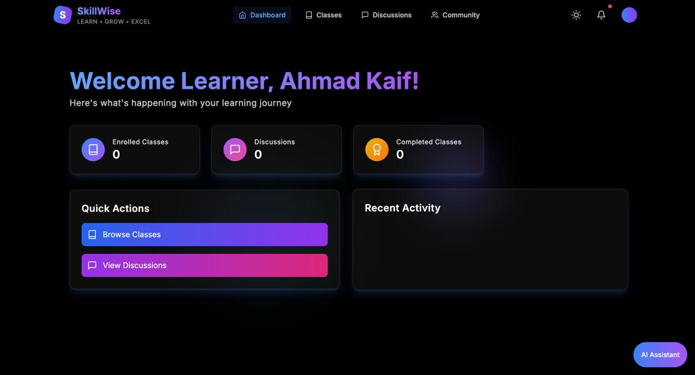
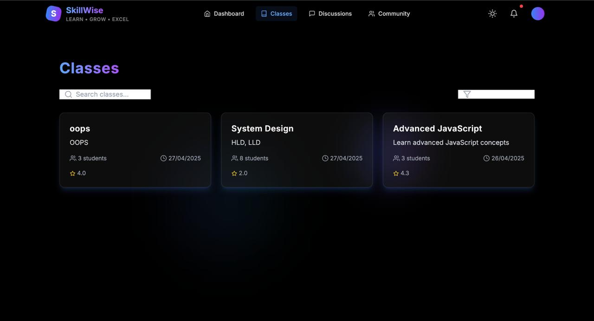
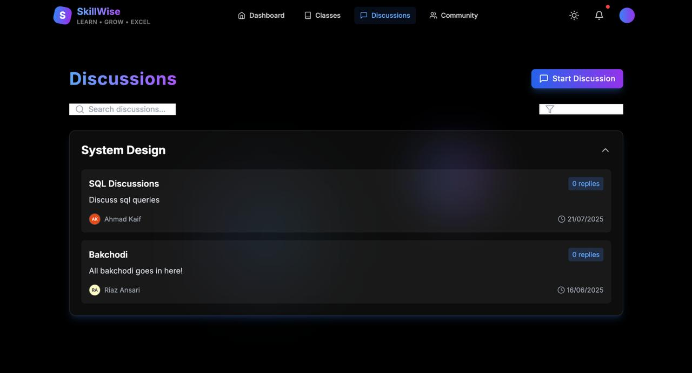
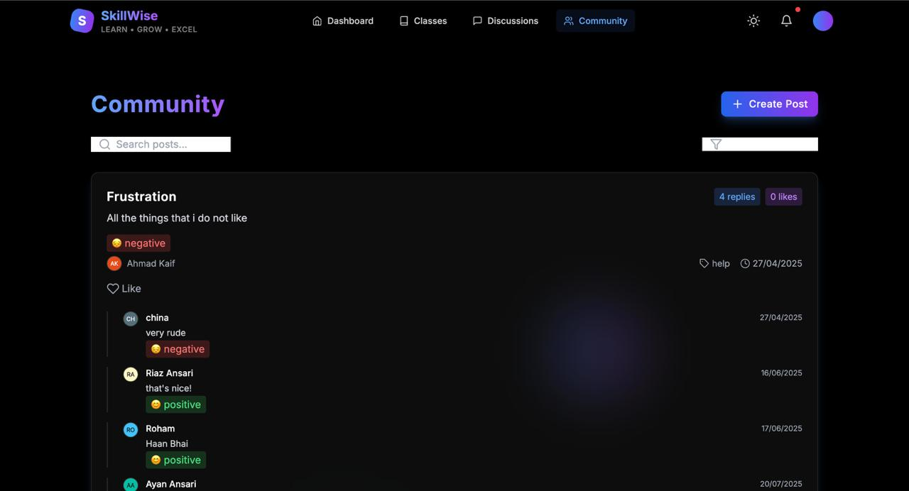
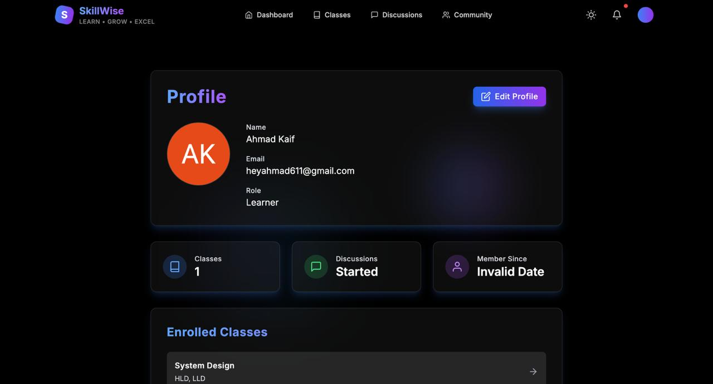
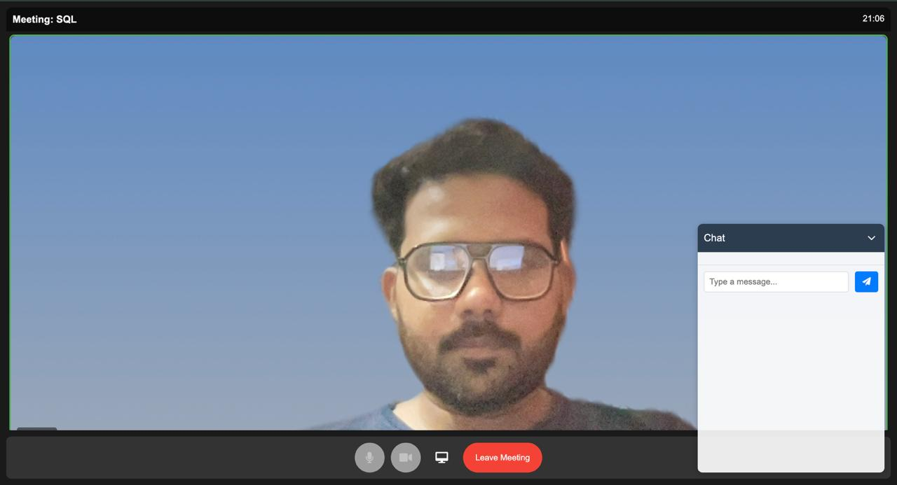

# SkillWise | A Peer-to-Peer Learning Platform

A collaborative learning platform where users can teach, learn, and share knowledge.

## Features

- User registration (Learners & Mentors)
- Class creation and management
- Live video sessions
- Community discussions with Sentiment Analysis
- Rating and review system
- Admin dashboard
- Search and filtering

  ## 📸 Screenshots

### 🏠 Homepage(Dashboard)


### 📊 Classes Dashboard

### 📊 Discussions Dashboard

### 📊 Community Dashboard

### 📊 Profile Dashboard


### 🎥 Live Class View



## Tech Stack

- Frontend: React, Tailwind CSS, Context API, Gemini API
- Backend: Node.js, Express
- Sentiment Analysis - Pretrained Model - distilbert
- Database: MongoDB
- Authentication: JWT stored in httpOnly Cookies
- Live Streaming: LiveKitCall

## Setup Instructions

1. Clone the repository
2. Install dependencies:
   ```bash
   npm install
   cd client
   npm install
   ```
3. Create a .env file in the root directory with:
   ```env
   MONGODB_URI=your_mongodb_uri
   JWT_SECRET=your_jwt_secret
   PORT=5000
   ```
4. Start the development server:
   ```bash
   # Run backend only
   npm run dev
   
   # Run frontend only
   npm run client
   
   # Run both
   npm run dev:full
   ```

## Project Structure

```
/
├── client/                 # React frontend
├── server/                 # Node.js backend
│   ├── controllers/       # Route controllers
│   ├── models/           # Database models
│   ├── routes/           # API routes
│   ├── middleware/       # Custom middleware
│   └── utils/            # Utility functions
├── .env                   # Environment variables
└── package.json          # Project dependencies
```
